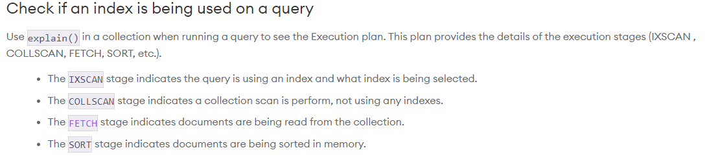
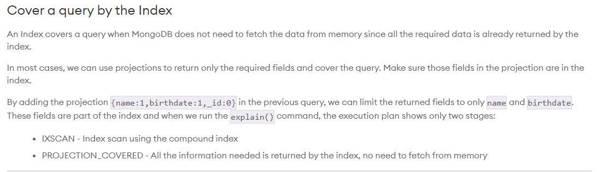

# MongoDB Indexes

## What are indexes?

Indexes store special data.

Store small portion of the data

Ordered and easy to search

Point to the document identity and allow us to search and update quickly

Indexes improve query performance

 - Speed up queries

 - Reduce disk I/O

 - Reduce resources required

 - Support equality matches and range-based operations and return sorted results

Without indexes, mongodb reads all documents in collection, and sorts result in memory

Indexes allows mongodb to fetch only the documents identified by the index based on the query, and returns the results faster

By default, there is only one index per collection which only includes the _id field.

Every query should use an index

## Drawbacks of indexes

When inserting or updating documents, will also need to update the index data structure

Too many indexes will reduce performance, ensure that all indexes created are being used else delete the redundent ones

## Common index types

Single field

Compound

 - Contains more than one field

Multikey Indexes operate on an array field

## Creating single field index

Single field indexes index on a single field, and support queries and sort on a single field

```sh
db.<collection>.createIndex({<fieldname>:1})

db.<collection>.createIndex({<fieldname>:1, {<constraint>: true}})

db.customers.createIndex({email:1}, {unique:true})

db.<collection>.getIndexes()

db.<collection>.explain().find(<query>)
# try to avoid collection scans
```

Atlas UI can also view indexs in collections



## Creating a Multikey Index

Multikey indexes are indexes on an array field, it can be single field or compound index

Can only have one array field per index

Mongodb takes the values within the array and stores it as individual entries

## Compound Index

Compound index is an index on multiple fields, it can be multikey index if it includes an array field

Compound index can support queries that match on the prefix of the index fields. Prefix is the first field in the compound index. Queries that do not contain the prefix cannot use the compound index. This is because indexes are ordered structures, and the order of the fields in a compound index matters.

Follow this order: Equality, Sort, Range

Equality

 -Test exact matches on single field

 - Should be placed first in a complex index

 - Reduces query processing time

 - Retrieves fewer documents

Sort

 - Determines the order of results

 - Index sort eliminates the need for in-memory sorts

 - Sort order is important if query results are sorted by more than 1 field and they mix sort orders

Sort and Range should come after equality to reduce in-memory sorting and filtering

Using projection can make processing easier if the index covers the projection. If the projection have more fields, can create compound index to include those fields at the end



## Deleting index

Indexes improve performance at a write cost. Having too many indexes in a collection can affect system performance, therefore redundant indexes should be deleted.

Deleting an index thats the only index supporting a query will affect the performance of the query.

Recreating an index takes time and resources, recommended to hide the index before deleting it, mongoDB do not use hidden indexes.

Can also drop index from Atlas UI

```sh
db.<collection>.hideIndex(<index>)

db.<collection>.dropIndex(<index>)
# can specify indexes by name or by key

db.<collection>.dropIndexes()
# drops all indexes except _id index if no params
```