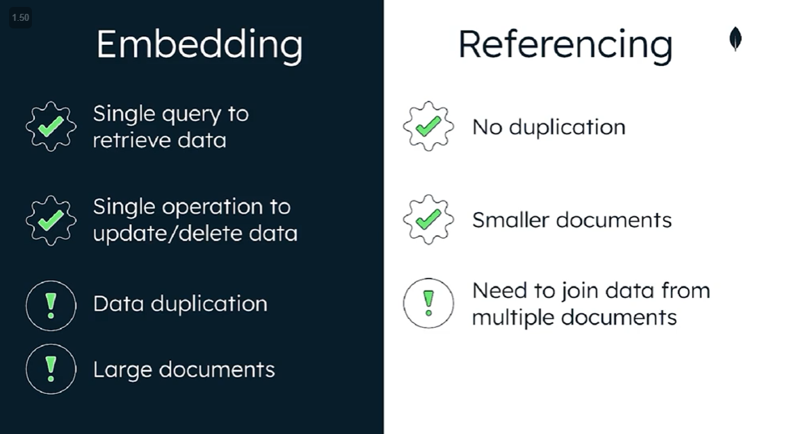

# Data Modeling

## Introduction

Data modeling is the way to define how data is stored, and the relationship between the different entities in data.

Schema is the organization of data in a database

To start thinking of how to design the schema, think about the application:

 > What does my application do?

 > What data will I store?

 > How will users access this data?

 > What data will be most valuable to me?

These questions will help in:

 - differentiating my tasks and the users tasks

 - visualising the data

 - showing the relationship among data

 - plan for tooling

 - finding access patterns

Having good data model can:

 - Make it easier to manage data

 - Make queries more efficient

 - Use less memory and CPU

 - Reduce costs

> Data that is accesses together should be stored together

MongoDB implements a flexible document data model, meaning that by default, documents have no fixed structures, and can have different structures even in the same collection (polymorphism)

MongoDB is schema flexible, schema can be defined and enforces with validation. Any kind of data can be stored in MongoDB, even documents with other documents nested or embedded.

Embedded document model enables us to build complex relationships among data.

Normalizing data can be done using database references, how application will use the data rather than how it's stored in the database

## Relationship types

Types of relationships

 - One to one

 - One to many

 - Many to many

Ways to model relationship

 - Embedding

 - Referencing

Structure data to match the ways that application queries and updates it

Data that is accessed together should be stored together

 - if the data is not stored together, the database must search through multiple collections to answer the query, incurring resource and time cost

One to one, a replationship where a data entity in one set is connected to exactly one data entity in another set

```sh
{
    "title": "Starwars",
    "director": "George Lucas"
}
```

One to many, a relationship where a data entity in one set is connected to any number of data entities in another set

```sh
{
    "title": "Starwars",
    # nested array
    "cast": [
        {"actor": "Mark Hamill", "character": "Luke Skywalker"},
        {"actor": "Harrison Ford", "character": "Han Solo"},
        {"actor": "Carrie Fisher", "character": "Princess Leia Organa"}
    ]
}
```

Many to many, a relationship where any number of data entities in one set are connected to any number of data entities in another set

Embedding is when we take related data and insert it into our document

 - Avoids application joins

 - Provides better performance for read operations

 - Allows developers to update related data in a single write operation

 - But it can create large documents that have to be read in memory in full, which can result in a slow application performance for end user

 - Unbounded documents are documents that can have data keep being added to it, it may risk reaching the maximum BSON document size of 16mb

Referencing is when we refer to documents in another collection in our document, this can be done by referencing the `ObjectID`

 - Storing related data in separte documents or collections

 - Also called linking or data normalization

 - Prevents duplication of data, thereby resulting in smaller documents
 
 - Querying from multiple documents costs extra resources and impacts read performance



## Scaling a data model

Avoid documents that are unbounded

 - take up more space in memory

 - impact write performance as each time the document is saved, it is being written

 - difficult to perform pagination

## Data Explorer and Performance Advisor in Atlas

Schema design patterns are guidelines that help developers plan, organize and model data.

Schema anti-pattern results in sub-optimal performance and non-scalable solutions

 - Massive arrays

 - Massive number of collections

 - Bloated documents

 - Unnessary indexes

 - Queries without indexes

 - Data that's accessed together but stored in different collections

Under collections, > Indexes

 - Shows the indexes that can be removed (redundent)

Under collections, > Schema-anti Pattern

Performance advisor can tell us which index can be dropped

Most tools are only available with paid tiers